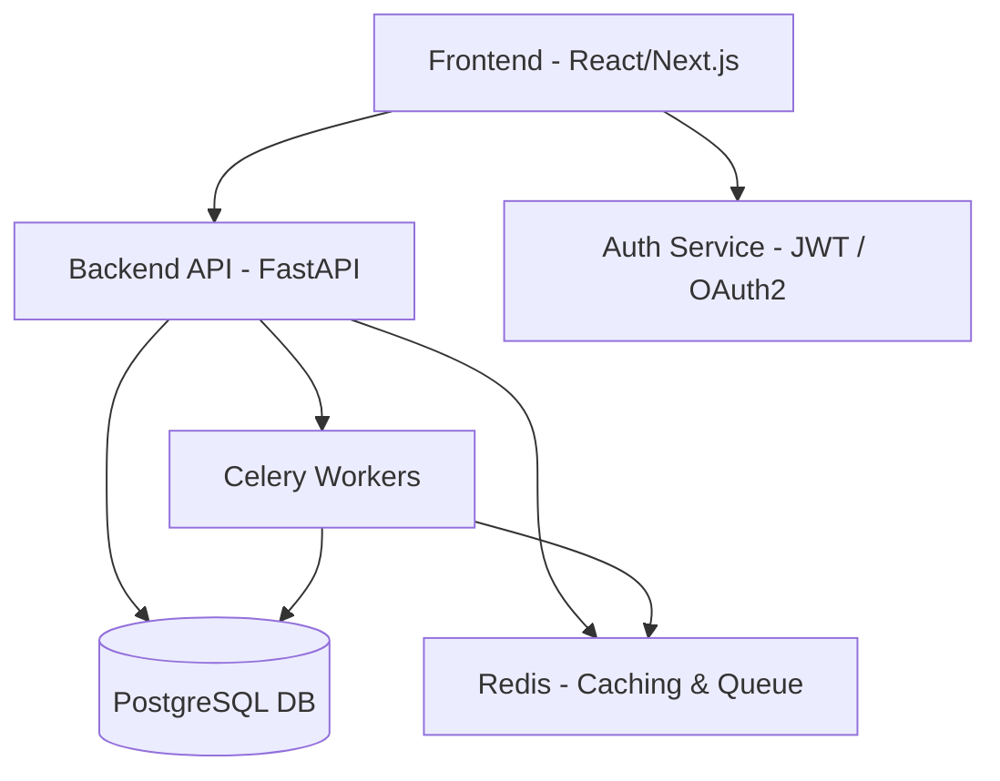
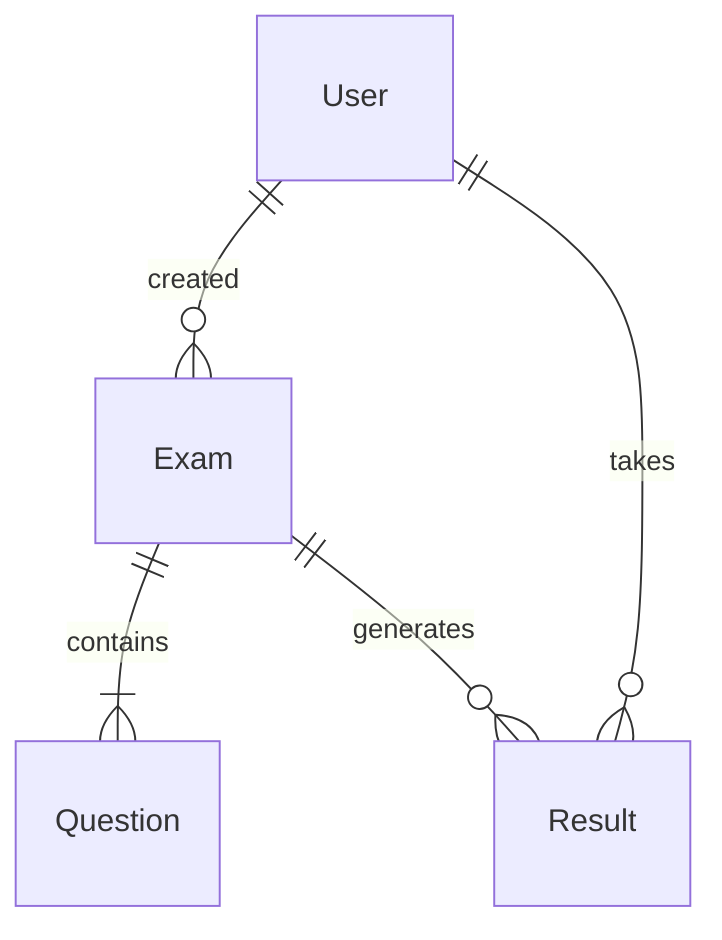

# 🚀 FAS ExamVault – Enterprise-Grade AI-Powered Assessment Platform

![FAS ExamVault Logo] I will place my logo link here

A modern, secure, AI-assisted digital examination platform for **schools, universities, and certification bodies**. Designed as a **portfolio-grade, production-ready project** to showcase full-stack, cloud, and AI engineering skills to top-tier US employers.

---

## 🌟 Why FAS ExamVault Matters

* **Integrity & Security:** Ensures tamper-proof exams with encryption and audit logs.
* **AI Efficiency:** Auto-grades MCQs and supports AI-assisted evaluation for subjective answers.
* **Global Scalability:** Suitable for 10–10 million students with cloud-based infrastructure.
* **Portfolio Impact:** Demonstrates mastery in full-stack development, cloud deployment, AI integration, and DevOps.

---

## 🏆 Key Features

* **Role-Based Access Control (RBAC):** Admin, Examiner, Student
* **Exam Management:** Create, approve, schedule, and tag questions by difficulty and topic
* **Digital Exam Delivery:** Web (Next.js + React) & Desktop (Tauri) with autosave
* **AI-Powered Grading:** Rule-based MCQs & AI-assisted short-answer evaluation
* **Results & Analytics:** Dashboards, CSV/PDF export, performance metrics
* **Security & Compliance:** AES-256 encryption, HTTPS, audit logs
* **Cloud Deployment:** Dockerized, CI/CD-ready, AWS S3 & EC2 compatible

---

## 🖼 Screenshots / Demo

*Note: 
![Dashboard] --- I want to put images link here
![Exam Interface] --- I want to put images link here
![Admin Analytics] --- I want to put images link here

---

## 🏗 Architecture Overview



---

## 🧩 Tech Stack

| Layer          | Technology                                |
| -------------- | ----------------------------------------- |
| Frontend       | Next.js + React + Tailwind CSS + Tauri    |
| Backend        | FastAPI (Python)                          |
| Database       | PostgreSQL                                |
| Cache/Queue    | Redis + Celery                            |
| Storage        | AWS S3 (encrypted)                        |
| Authentication | JWT + OAuth2                              |
| DevOps         | Docker, Docker Compose, GitHub Actions    |
| AI Grading     | Python module (rule-based) + LLM (future) |

---

## 📂 Folder Structure

```
fas-examvault-mvp/
│
├── backend/
│   ├── app/
│   ├── alembic/
│   ├── requirements.txt
│   └── Dockerfile
│
├── frontend/
│   ├── src/
│   ├── pages/
│   ├── public/
│   └── tailwind.config.js
│
├── desktop/
│   ├── src-tauri/
│   ├── package.json
│   └── tauri.conf.json
│
├── docker-compose.yml
└── README.md
```

---

## ⚡ Getting Started

### Prerequisites

* Python 3.11+
* Node.js 18+
* PostgreSQL 15+
* Redis 7+
* Docker & Docker Compose
* AWS account (S3 + IAM)

### Backend Setup

```bash
cd backend
python -m venv venv
source venv/bin/activate  # Windows: venv\Scripts\activate
pip install -r requirements.txt
# create .env with DATABASE_URL, REDIS_URL, SECRET_KEY, AWS keys, ENCRYPTION_KEY
alembic upgrade head
uvicorn app.main:app --reload --host 0.0.0.0 --port 8000
```

### Frontend Setup

```bash
cd frontend
npm install
npm run dev
# Open http://localhost:3000
```

### Desktop App

```bash
cd desktop
npm install
npm run tauri dev
```

---

## 🔐 Security Highlights

* AES-256 encryption for all submissions
* HTTPS enforced for all API traffic
* Role-based access control (Admin, Examiner, Student)
* Audit logs for every action (create/edit/delete/grade)
* JWT validation on each request

---

## 📘 API Examples

### Create Exam

**POST /api/exams**

```json
{
  "title": "Physics Midterm",
  "duration": 90,
  "course": "PHY101",
  "questions": [1,2,3,4]
}
```

### Response

```json
{
  "status": "success",
  "exam_id": 12
}
```

---

## 🗂 Database Structure (ER Diagram)



---

## 🛠 Development Guidelines

* Branch naming: `feature/<name>`, `fix/<name>`, `chore/<name>`
* Conventional commits: `feat: add feature`, `fix: resolve bug`, `docs: update README`
* All PRs must include unit/integration tests
* CI/CD runs lint, tests, and build

---

## 🛣 MVP Roadmap

* **Week 1:** Backend setup, authentication, DB schema, exam/question CRUD
* **Week 2:** MCQ auto-grading, manual short-answer grading, submissions & encryption
* **Week 3:** Frontend dashboards, exam UI, Tauri desktop integration
* **Week 4:** Testing, security audit, pilot deployment

---

## 🌟 Future Enhancements

* AI-assisted essay grading & handwritten recognition
* Offline exam mode with auto-sync
* AI proctoring: facial detection & keystroke dynamics
* Mobile apps (iOS & Android)
* Advanced analytics dashboards

---

## 🤝 Contributing

Pull requests welcome! Follow coding guidelines, write tests, and ensure CI/CD passes.

---

## 📄 License

MIT License

---


## 🔗 Live Demo / Contact

*I will add the deploy link here.*
